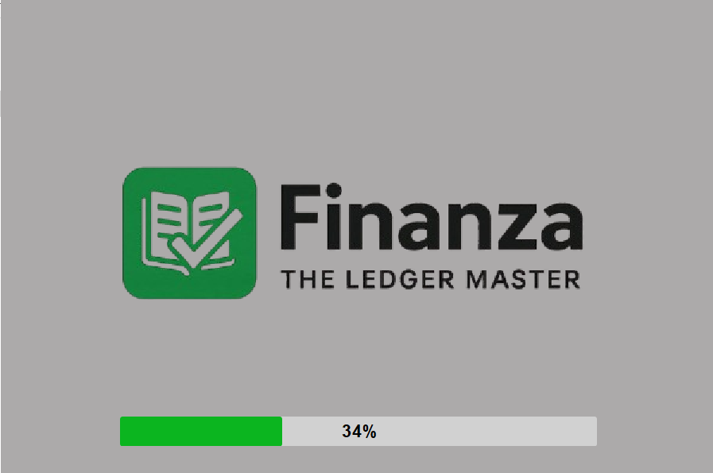
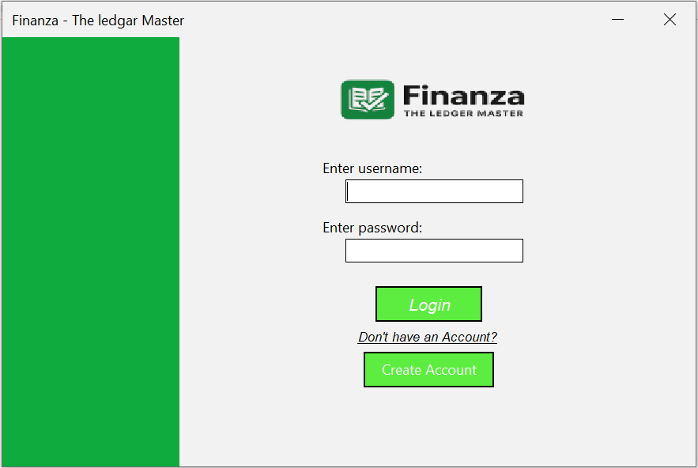
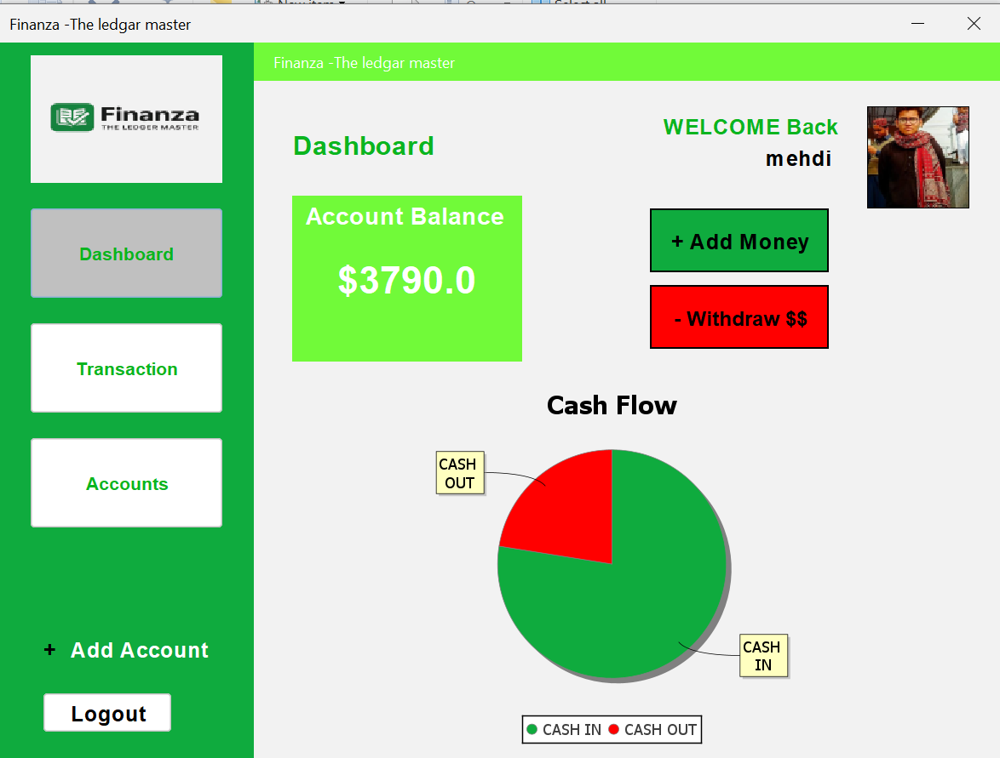
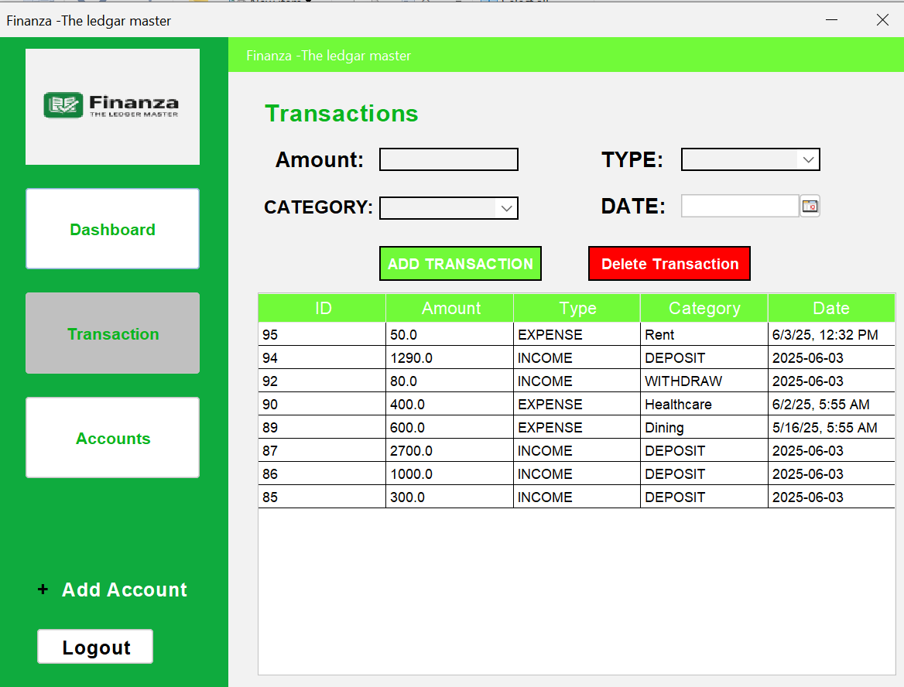
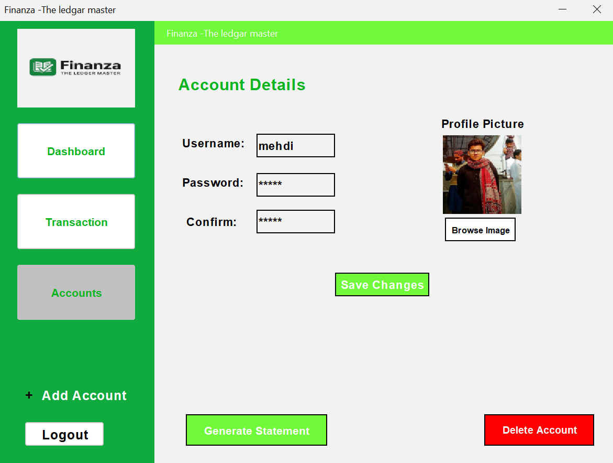
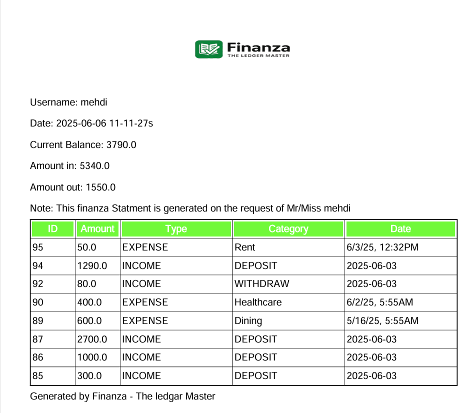

# 💸 Finanza - Ledger Management System

**Finanza** is a lightweight yet powerful Java-based desktop application designed to simplify personal and small-business finance management. With an intuitive interface and modular design, Finanza empowers users to manage transactions, accounts, and financial summaries with ease.

---
## 🔽 Download

Click the link below to download the executable:

[]([](https://github.com/username/repo-name/releases/download/v1.0/yourfile.exe)
)


## 🌟 Features

- 🧾 **Transactions Management**
  - Add, update, delete, and view transactions.
  - Categorize income and expenses for better tracking.

- 👤 **Account Handling**
  - Manage multiple accounts (Cash, Bank, Wallet, etc.)
  - View balance summaries and transaction history.

- 📊 **Dashboard Overview**
  - Real-time analytics of your financial data.
  - Monthly income/expense charts and trends.

- 🔍 **Search & Filter**
  - Quickly search transactions by date, category, or description.

- 🧩 **Modular Design**
  - Easily extendable for future features like budgeting or reporting.

---

## 🛠️ Technologies Used

- **Java SE 17**
- **Java Swing** for GUI
- **JDBC** for database connectivity
- **SQLite/MySQL** as backend database (configurable)
- **IntelliJ IDEA** for development

---

## 🖼️ Screenshots

### 📊 Splash Screen
&nbsp;&nbsp;&nbsp;&nbsp;


### 📊 Create Account
&nbsp;&nbsp;&nbsp;&nbsp;

### 📊 Login
&nbsp;&nbsp;&nbsp;&nbsp;

### 📊 Dashboard
&nbsp;&nbsp;&nbsp;&nbsp;


### 📊 Transactions
&nbsp;&nbsp;&nbsp;&nbsp;


### 📊 Accounts
&nbsp;&nbsp;&nbsp;&nbsp;

### 📊 Bank Statement
&nbsp;&nbsp;&nbsp;&nbsp;


---

## 🚀 Getting Started

### Prerequisites

- Java JDK 17+
- IntelliJ IDEA (or any Java IDE)
- SQLite or MySQL (optional based on configuration)

### How to Run

1. Clone the repository:
   ```bash
   git clone https://github.com/hussainwaseer/Finanza--The-ledgar-master
   ```
2. Open in IntelliJ IDEA.
3. Configure database settings in `DatabaseConnector.java`.
4. Run `Main.java`.

---

## 📂 Project Structure

```bash
Finanza/
├── src/
│   ├── dashboard/
│   ├── transactions/
│   ├── accounts/
│   ├── ledgar.db/
│   ├── createAccount/
│   ├── login/
│   ├──SplashScreen/
│   └── main/  
├── images/
│   └── screenshots/
├── Libraries/
│   └── used Libraries/
├── README.md
└── Finanaza Final report.pdf
```

---

## 👥 Authors

- **Muhammad Hussain Waseer**
- **Muhammad Mehdi Mangi**

---

## 📃 License

This project is for educational purposes only. Feel free to use and modify it for personal or academic projects.

---

## 📫 Contact

Have questions or suggestions? Reach out:

- 📧 Email: muhammadhussain.bscsaif24@iba-suk.edu.pk
- 🌐 GitHub: https://github.com/hussainwaseer/Finanza--The-ledgar-master/tree/main

---

> “Track smart. Spend wise. Grow better.” — **Finanza**
